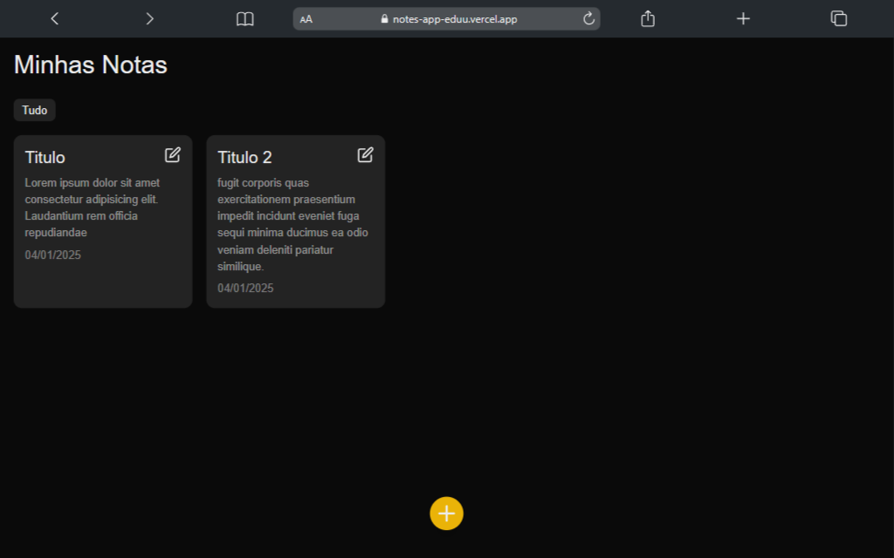

<h1 align="center" style="font-weight: bold;">Notes APP 💻</h1>

<p align="center">
    <b>Um website permite criar, organizar e acessar suas anotações de forma rápida e fácil. Ideal para estudantes, profissionais e qualquer pessoa que precise manter suas ideias organizadas</b>
</p>

<p align="center">
     <a href="https://notes-app-eduu.vercel.app/">📱 Visite este Projeto</a>
</p>

<h2 id="layout">🎨 Layout</h2>

<p align="center">
    
</p>

<h2 id="technologies">💻 Technologies</h2>

- Next.js
- Tailwind CSS

<h2 id="started">🚀 Começando</h2>

Execute esse codigo no terminal para começar esse projeto 
```bash
npm run dev
```

<h3>Pré-requisitos</h3>

Pré-requisitos ter o nodejs e o git instalados em sua maquina 

- [NodeJS](https://nodejs.org/pt)
- [Git](https://git-scm.com/downloads)


<h3>Clonagem</h3>

Como clonar meu projeto execute esse codigo no terminal

```bash
git clone https://github.com/eduardomendes117/vidflow-app
```
